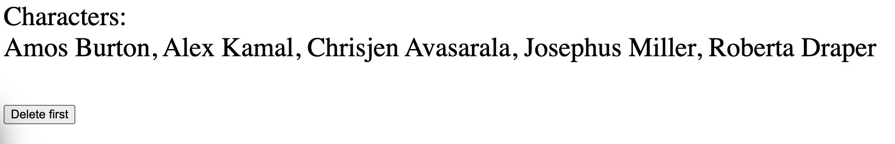

# Description

The project aim to implement an working example of Caliban subscription. 

It is based on:

- Scala.js Laminar example [http4s-laminar-stack](https://github.com/keynmol/http4s-laminar-stack)
- Caliban example for subscription
  - Backend of above example complete with those files from Caliban examples:
    - [ExampleApi.scala]((https://github.com/ghostdogpr/caliban/tree/series/2.x/examples/src/main/scala/example/ExampleData.scala))
    - [ExampleData.scala]((https://github.com/ghostdogpr/caliban/tree/series/2.x/examples/src/main/scala/example/ExampleData.scala))
    - [ExampleService.scala]((https://github.com/ghostdogpr/caliban/tree/series/2.x/examples/src/main/scala/example/Example.Service.scala))
    - [ExampleApp.scala](https://github.com/ghostdogpr/caliban/blob/series/2.x/examples/src/main/scala/example/http4s/ExampleApp.scala)
  - Frontend of above example completed with those file from (https://github.com/ghostdogpr/caliban/tree/series/2.x/client-laminext/src/test/scala/caliban/client/laminext):
    - Client.scala
    - Main.scala
    - Page.scala

# Usage

1. Run frontend

   ```
   sbt "~fastOptCompileCopy"
   ```

   

2. Run backend 

   ```
   sbt "~backend/run"
   ```

3. In 2 browser windows, open http://localhost:9000/frontend

4. When you clicke "Delete first", you should see in real time the first also removed in the other window.

# UI

UI should look like this:



